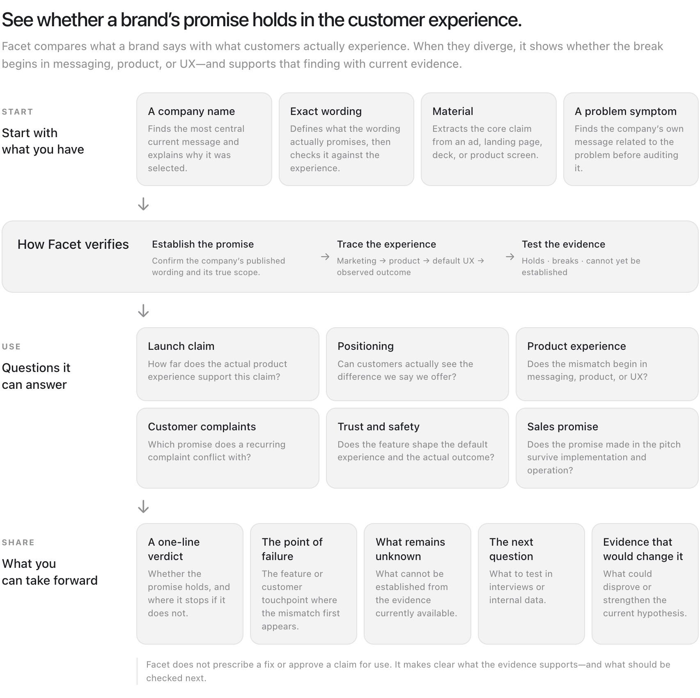
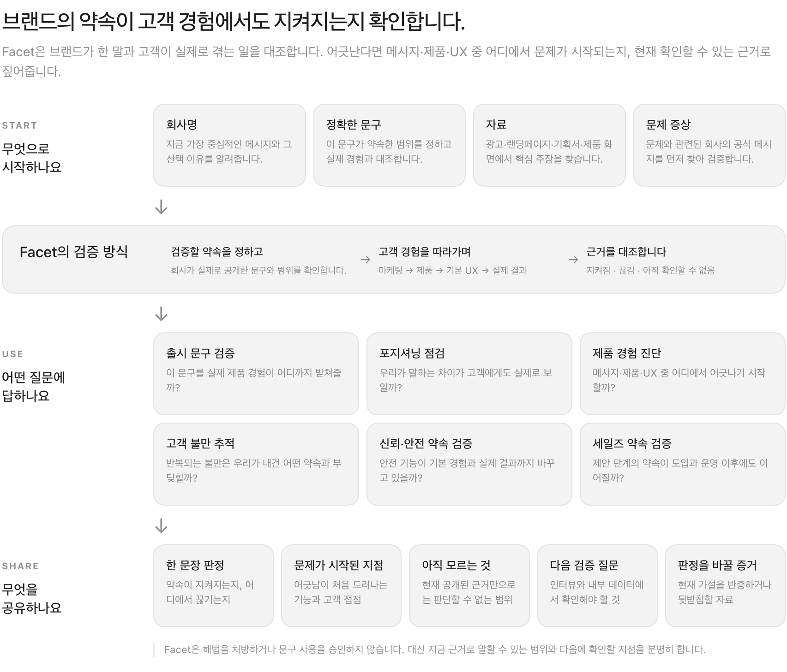

# Facet

**Start with a company, exact wording, material, or only a symptom. Facet finds the published promise that governs the question and verifies whether it holds, or exactly where it stops.**

> Simple and intuitive on the front. Obsessive about verification underneath.

Facet is a verification-first Agent Skill. Its first public skill, **Facet Core**, audits one company at a time and returns a plain-language verdict backed by current evidence.

**회사명, 문구, 자료 또는 증상으로 시작하면 회사가 실제로 내건 약속을 먼저 찾습니다. 그 약속이 제품 경험에서 지켜지는지, 아니라면 정확히 어디서 끊어지는지 검증합니다.**

## What Facet is for

**Facet verifies whether a brand's promise holds in the customer experience. When it does not, it shows where the break begins.**

Facet compares what a brand says with what customers actually experience. It traces the message across marketing, product, default UX, and observed outcomes, then returns a source-backed verdict.

### Start with what you have

| Start with | Example | What Facet does first |
|---|---|---|
| A company name | `$facet-core Toss`<br>`$facet-core 토스` | Finds the most central current message and explains why it was selected |
| Exact wording | `$facet-core Check whether OpenAI's "one system, one identity" holds in the product experience`<br>`$facet-core OpenAI의 "one system, one identity"가 제품 경험에서도 유지되는지 봐줘` | Defines what the wording promises, then checks it against the relevant experience |
| A page, ad, deck, or screen | `$facet-core Check whether this landing page creates the same expectation as the product`<br>`$facet-core 이 랜딩페이지가 실제 제품과 같은 기대를 만드는지 봐줘` | Extracts the core claim and compares it with the product experience |
| A problem symptom | `$facet-core Customers say they cannot tell what makes us different. Find where the problem is`<br>`$facet-core 고객들이 우리 차이를 모르겠다고 하는데 어디가 문제인지 봐줘` | Uses the symptom to find the company's own published message before auditing it |

A symptom starts the search. It never becomes the company's promise. When no governing published wording can be established from the reviewed evidence, that absence is reported without claiming the company never made such a promise.

If several propositions are equally central and the choice would materially change the result, Facet asks which one to trace. If material evidence is inaccessible, it requests at most two items in two lines or fewer.

### How Facet verifies

| Step | What happens |
|---|---|
| 1. Establish the promise | Confirms the company's published wording and the scope it actually governs |
| 2. Trace the experience | Follows the message through marketing, product, default UX, and observed outcome |
| 3. Test the evidence | Determines whether the promise holds, breaks, or cannot yet be established |

### Questions Facet can answer

| Use case | Question |
|---|---|
| Launch claim | How far does the actual product experience support this claim? |
| Positioning | Can customers see the difference the company says it offers? |
| Product experience | Does the mismatch begin in messaging, product, or UX? |
| Customer complaints | Which published promise does a recurring complaint conflict with? |
| Trust and safety | Does the feature shape the default experience and the actual outcome? |
| Sales promise | Does the promise survive implementation and operation? |

### What you can take forward

| Output | What it tells you |
|---|---|
| A one-line verdict | Whether the promise holds, and where it stops if it does not |
| The point of failure | The product behavior or customer touchpoint where the mismatch first appears |
| What remains unknown | What cannot be established from the available evidence |
| The next verification question | What to investigate in interviews or internal data |
| Evidence that would change the verdict | What could disprove or strengthen the current hypothesis |

Facet does not prescribe a fix or approve a claim for use. It makes clear what the evidence supports and what should be checked next.



## Facet은 어디에 쓰나요?

**Facet은 브랜드가 한 말이 고객 경험에서도 지켜지는지 확인하고, 어긋난다면 메시지·제품·UX 중 어디에서 문제가 시작되는지 근거로 짚어주는 스킬입니다.**

### 무엇으로 시작하나요

| 가지고 있는 것 | Facet이 먼저 하는 일 |
|---|---|
| 회사명 | 지금 가장 중심적인 메시지와 그 선택 이유를 알려줍니다 |
| 정확한 문구 | 이 문구가 약속한 범위를 정하고 실제 경험과 대조합니다 |
| 광고·랜딩페이지·기획서·제품 화면 | 자료의 핵심 주장을 찾아 제품 경험과 비교합니다 |
| 문제 증상 | 문제와 관련된 회사의 공식 메시지를 먼저 찾아 검증합니다 |

증상은 검색의 출발점일 뿐, 회사의 약속으로 간주하지 않습니다.

### Facet의 검증 방식

| 단계 | 하는 일 |
|---|---|
| 1. 검증할 약속을 정하고 | 회사가 실제로 공개한 문구와 범위를 확인합니다 |
| 2. 고객 경험을 따라가며 | 마케팅, 제품, 기본 UX, 실제 결과 순으로 따라갑니다 |
| 3. 근거를 대조합니다 | 지켜짐, 끊김, 아직 확인할 수 없음 중 하나로 판정합니다 |

### 어떤 질문에 답하나요

| 활용 | 질문 |
|---|---|
| 출시 문구 검증 | 이 문구를 실제 제품 경험이 어디까지 받쳐줄까? |
| 포지셔닝 점검 | 우리가 말하는 차이가 고객에게도 실제로 보일까? |
| 제품 경험 진단 | 메시지·제품·UX 중 어디에서 어긋나기 시작할까? |
| 고객 불만 추적 | 반복되는 불만은 우리가 내건 어떤 약속과 부딪힐까? |
| 신뢰·안전 약속 검증 | 안전 기능이 기본 경험과 실제 결과까지 바꾸고 있을까? |
| 세일즈 약속 검증 | 제안 단계의 약속이 도입과 운영 이후에도 이어질까? |

### 무엇을 공유하나요

| 결과물 | 알 수 있는 것 |
|---|---|
| 한 문장 판정 | 약속이 지켜지는지, 어디에서 끊기는지 |
| 문제가 시작된 지점 | 어긋남이 처음 드러나는 기능과 고객 접점 |
| 아직 모르는 것 | 현재 공개된 근거만으로는 판단할 수 없는 범위 |
| 다음 검증 질문 | 인터뷰와 내부 데이터에서 확인해야 할 것 |
| 판정을 바꿀 증거 | 현재 가설을 반증하거나 뒷받침할 자료 |

Facet은 해법을 처방하거나 문구 사용을 승인하지 않습니다. 대신 지금 근거로 말할 수 있는 범위와 다음에 확인할 지점을 분명히 합니다.



## See what Facet finds in 20 seconds

### TikTok · a verified break

> **Product problem in the recommendation feed's defaults: Trust & Safety and Recommendation stop meeting there.**

**English**

```text
"Serious about Safety"
        ↓ holds
content removal · screen-time limits · Family Pairing
        ↓ breaks here
how the recommendation feed chooses and continues the next video
        ↓
infinite scroll · autoplay · personalized recommendation
```

**한국어**

```text
"안심에 진심"
        ↓ 유지됨
콘텐츠 삭제 · 사용 시간 제한 · 패밀리 페어링
        ↓ 여기서 끊김
추천 피드가 다음 영상을 선택하고 계속 이어가는 방식
        ↓
무한 스크롤 · 자동 재생 · 개인화 추천
```

**Why it may be this way**

Hard to discover + setup burden + easy-to-dismiss controls. The safety features can pause viewing or ask people to manage limits, while the recommendation feed continues choosing the next video from viewing behavior. Public evidence does not show how strongly wellbeing measures constrain that decision.

[Read the complete TikTok audit in English](examples/tiktok-safety-priority.en.md) · [한국어 전체 감사 보기](examples/tiktok-safety-priority.md)

### A sample of the returned answer

This is how the same audit arrives, in the fixed output order.

> **Diagnosis: this is a product problem, not a messaging problem.**

- **Main problem location:** the recommendation feed's defaults and its screen-time controls
- **Where the connection breaks:** Trust & Safety ↔ Recommendation
- **Also visible:** feature launches and removal counts ↔ measurement of actual protection

**Where the message travels**

| Connection | What is actually there |
|---|---|
| Message → safety features | Content removal, teen defaults, and Family Pairing genuinely exist |
| Safety features → actual use | Stronger protection requires a parent to know about it, link an account, and set it up |
| Default UX → actual protection | The prompt can be passed, and the same recommendation feed resumes after it |

**What the product shows**

Accounts under 18 have a 60-minute daily limit by default. When someone under 16 opens TikTok after 10pm, the For You feed is interrupted by a full-screen prompt. Raising the level of protection requires a parent to link accounts and adjust the settings themselves. In February 2024, accounts with Family Pairing active came to 4-5% of TikTok's UK teen monthly users. [TikTok teen protections](https://newsroom.tiktok.com/new-ways-we-are-supporting-parents-and-helping-teens-build-balanced-digital-habits?lang=en) · [Ofcom](https://www.ofcom.org.uk/online-safety/protecting-children/how-tiktok-snap-twitch-protect-children-from-harmful-videos)

**Why it may be this way**

**Known but rarely switched on.** Family Pairing was active on 4-5% of UK teen accounts as of February 2024.

**Setup burden.** Stronger protection requires a parent to create an account, link it to the teen's, and set the limits by hand.

**A default prompt that is easy to pass.** At the limit, entering a passcode the user set themselves returns them to the feed, and the limit itself can be switched off.

> **TikTok built safety as protective features that users and parents operate around the feed, rather than as a rule that constrains the feed itself.**

Every claim above carries its source in the full audit, with the run date and the scope it was verified against.

## [What's new in v0.6.1](https://github.com/jovelove7/facet/releases/latest)

- **A break begins with a diagnosis.** Facet names the kind of problem, its location in the product, and the public-facing functions that stop meeting.
- **A promise that holds is a result.** The audit no longer invents a failure when the evidence supports the stated objective.
- **Scope comes before judgment.** A design brief is judged against design; a launch claim is judged against that launch. Adjacent issues cannot lower an unrelated verdict.
- **You can start with a symptom.** Facet first locates and discloses the company's actual published wording.
- **A divided structure is not automatically a divided experience.** Facet checks the route a user can actually take before calling the split a break.
- **Safety and priority claims receive stronger checks.** Discoverability, setup burden, default strength, dismissal cost, reversibility, coverage, and measured outcomes are tested separately.
- **Competing hypotheses now point in two directions.** Every verified break is tested against both a constraint explanation and a deliberate-choice explanation.

## What Facet Core returns

Every default answer follows one fixed reader-facing order:

1. a plain-language verdict;
2. `Where the message travels` - the path from promise to observed reality;
3. `What the company says` - the current proposition and its scope;
4. `What the product shows` - concrete product or service moments;
5. `Where it changes` - the diagnosis, or a direct statement that the promise held;
6. `Why it may be this way` - the evidence behind a held result, the best-surviving explanation for a break, or an explicit unknown.

Facet answers in the language used in the request. The order never changes; the labels are localized. In Korean, the same sections read `메시지 이동 경로`, `회사가 하는 말`, `제품에서 보이는 것`, `어디서 틀어지나`, and `왜 그런 것으로 보이나`.

The visible answer stays compact. Underneath, Facet verifies claim scope, evidence directness, relationships across surfaces, competing hypotheses, and falsification conditions.

Ask for more only when you need it: the evidence chain, competing explanations, unknowns, or what evidence would change the verdict.

## Boundaries

Facet reports what the evidence supports. It does not rank companies, recommend vendors, prescribe a fix, or infer how internal teams and individuals relate.

When asked whether a line can be used in advertising, Facet converts the request into an evidence audit. It reports:

- what the product confirms;
- what holds only under a condition;
- what has no public evidence;
- what describes something other than the observed experience.

It does not approve the line, rewrite it, or determine legal defensibility.

## Verification principles

- Judge a promise only against the surface it actually governs.
- A promise that holds is a result; never manufacture a break.
- Treat a capability as evidence of capability, not automatic proof of priority, effectiveness, or outcome.
- Observe brand, marketing, product, UX, policy, support, outcomes, and independent evidence separately before judging the whole.
- Compare the same claim dimensions and keep product, market, audience, geography, and time scope attached to the evidence.
- Treat missing evidence as uncertainty or omission, not contradiction.
- Generate a constraint hypothesis and a choice hypothesis, then attack both.
- Check the user's actual route before treating a divided structure as a divided experience.
- Name where a problem sits, never what to build.
- Use the company's public wording for its functions and make no claim about its teams or people.
- Let evidence strength control the verb instead of displaying a confidence badge.
- Hide internal calculations, not the reasoning bridge the reader needs.

## Worked examples

The repository includes unedited answers with their sources, run dates, and audit scope.

- **OpenAI · a promise that held** - The "one system, one identity" design brief achieved the visual integration it governed. Product continuity is a separate consideration, not evidence that the rebrand failed. [English](examples/openai-one-system-one-identity.en.md) · [한국어](examples/openai-one-system-one-identity.md)
- **TikTok · a verified break** - "Serious about Safety" reaches real safety features, then stops where those features would have to change how the recommendation feed behaves. [English](examples/tiktok-safety-priority.en.md) · [한국어](examples/tiktok-safety-priority.md)
- **Toss · a split that was not a break** - Facet selected and disclosed the proposition itself. Separate support routes turned out to be organized by the user's task, with a catch-all route still available. [English](examples/toss-all-in-one.en.md) · [한국어](examples/toss-all-in-one.md)

The examples land on different results on purpose: a promise that held, a material break, and a structure that looked divided but did not divide the experience.

## Install

### From a release

Download the latest package from [Releases](https://github.com/jovelove7/facet/releases/latest), then unpack it into your personal skills directory.

```bash
unzip facet-core-v0.6.1.zip -d ~/.codex/skills/
```

Every release publishes a SHA-256 checksum next to the package.

### From the repository

```bash
git clone https://github.com/jovelove7/facet.git
cp -R facet/skills/facet-core ~/.codex/skills/facet-core
```

Restart Codex if the skill does not appear immediately.

### Other Agent Skills clients

Use the `skills/facet-core` directory as the skill package. `SKILL.md` is the entry point; files in `references/` are loaded only when needed.

## Repository layout

```text
facet/
├── skills/facet-core/
│   ├── SKILL.md                        # rules and workflow
│   ├── agents/openai.yaml
│   └── references/
│       ├── entry-points.md             # company, wording, material, symptom
│       ├── evidence-protocol.md        # source order and scope
│       ├── relationship-rubric.md      # preserved, compressed, divergent, unknown
│       ├── capability-to-protection.md # safety and priority checks
│       ├── hypothesis-protocol.md      # constraint and choice hypotheses
│       ├── diagnosis.md                # problem categories and held verdicts
│       └── output-contract.md          # fixed order and localized labels
├── examples/                           # unedited, sourced audit results
├── tests/                              # regression prompts and invariants
├── scripts/check_skill.py              # structural and output-contract checks
├── CONTRIBUTING.md
└── LICENSE
```

## Validate

```bash
python3 scripts/check_skill.py
```

The regression suite is conclusion-agnostic. It checks the method and output contract instead of freezing a historical answer.

## Corrections

Examples are accurate to their run date, not standing claims. Found an error or newer evidence? Open an issue with a dated source.

## License

[MIT](LICENSE)
